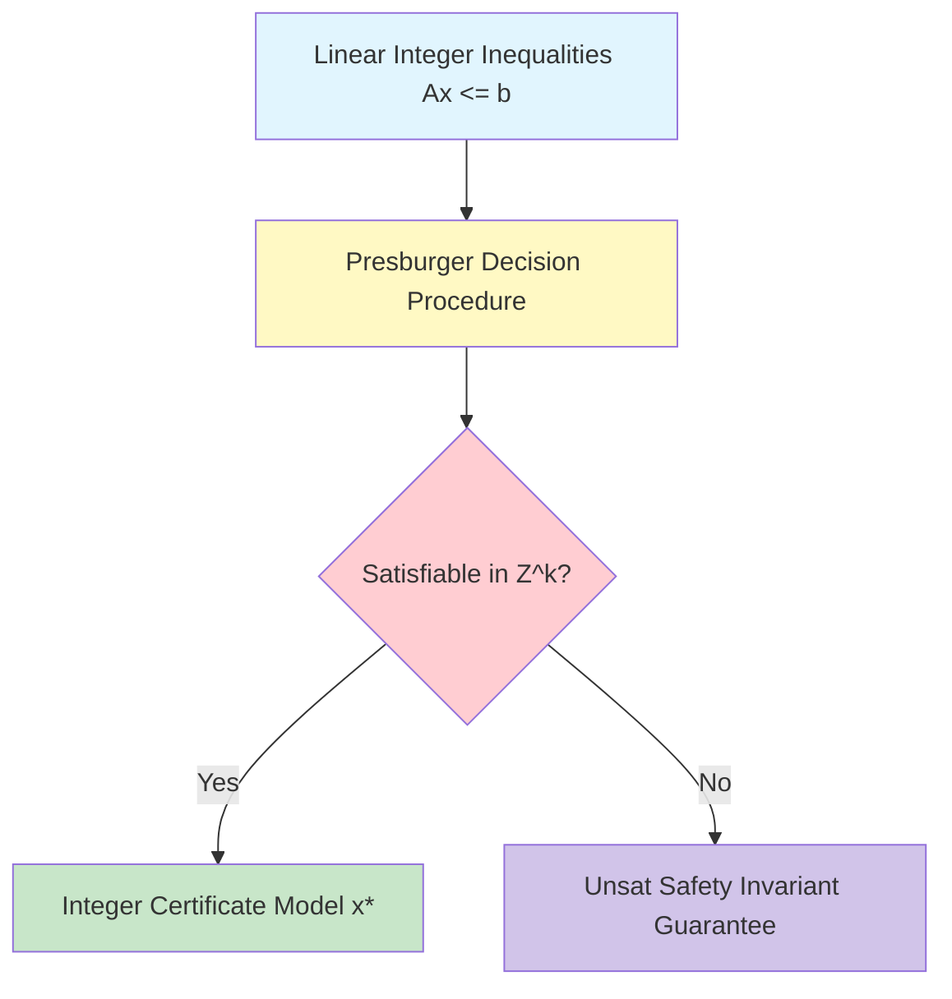

# GenPark Presburger Linear Integer Arithmetic Solver Skill

Presburger linear integer arithmetic decision procedure solving systems of linear inequalities.

Read more at [GenPark](https://genpark.ai) and the [GenPark MCP Catalog](https://genpark.ai/mcp).

## Features
- Quantifier-free linear integer arithmetic constraint satisfaction.
- Zero external dependencies.
